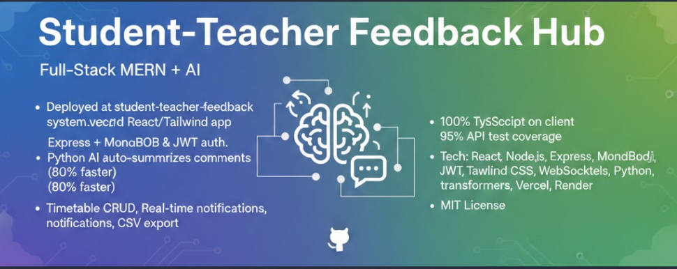

# Student Teacher Feedback System



[](https://opensource.org/licenses/MIT)
[](https://nodejs.org/)

A comprehensive web application designed to facilitate feedback, communication, and management between students and teachers. This system includes features for course feedback, timetable management, and intelligent notifications, powered by an AI service for feedback summarization.

site link- https://student-teacher-feedback-system.vercel.app
UI/UX- https://github.com/KirtanDwivedi/UI-UX--stfs

## 🚀 Features

- **Teacher Dashboard**: Manage courses, view feedback, and organize timetables.
- **Student Dashboard**: Submit feedback, view timetables, and receive notifications.
- **Feedback System**: specialized forms for course and teacher feedback.
- **AI-Powered Summarization**: Automates the summarization of student feedback using a Python-based AI service.
- **Timetable Management**: Easy scheduling and viewing of classes.
- **Notifications**: Real-time updates for students and teachers.

## 🛠️ Tech Stack

### Client (Frontend)
- **Framework**: [React](https://reactjs.org/)
- **Styling**: [Tailwind CSS](https://tailwindcss.com/)
- **State Management**: React Hooks

### Server (Backend)
- **Runtime**: [Node.js](https://nodejs.org/)
- **Framework**: [Express.js](https://expressjs.com/)
- **Database**: [MongoDB](https://www.mongodb.com/)
- **Authentication**: JWT (JSON Web Tokens)


## 📂 Project Structure

```bash
root/
├── client/           # React Frontend Application
├── server/           # Express Backend API
└── README.md         # Project Documentation
```

## ⚙️ Setup & Installation

Follow these steps to get the project running on your local machine.

### Prerequisites
- Node.js (v14 or higher)
- npm or yarn
- MongoDB (Local or Atlas URL)

### 1. Server Setup

Navigate to the server directory and install dependencies:

```bash
cd server
npm install
```

Create a `.env` file in the `server` directory with the following variables:

```env
PORT=5000
MONGO_URI=your_mongodb_connection_string
JWT_SECRET=your_jwt_secret_key
```

Start the server:

```bash
npm run dev
# OR
npm start
```

### 2. Client Setup

Open a new terminal, navigate to the client directory, and install dependencies:

```bash
cd client
npm install
```

Start the React development server:

```bash
npm run dev
# OR
npm start
```

The application should now be running (typically on `http://localhost:5173` or `http://localhost:3000`).


## 🤝 Contributing

Contributions are welcome! Please fork the repository and create a pull request.

## 📄 License

This project is licensed under the MIT License.
